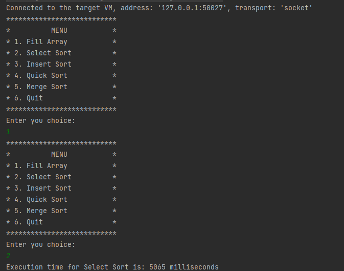

<h1 align="center">四种排序算法</h1>

QQ群: 377586148(加群获取sql文件)

 [个人站点: 从戎源码网](https://armycodes.com/)

## 简介

> 本代码来源于网络,仅供学习参考使用!
>

## 项目介绍
四种排序算法: 插入排序,选择排序,快速排序,归并排序，提供源码参考

插入排序

选择排序

快速排序

归并排序

## 环境

- <b>IntelliJ IDEA 2009.3</b>

- <b>JDK 1.8</b>

## 运行截图
